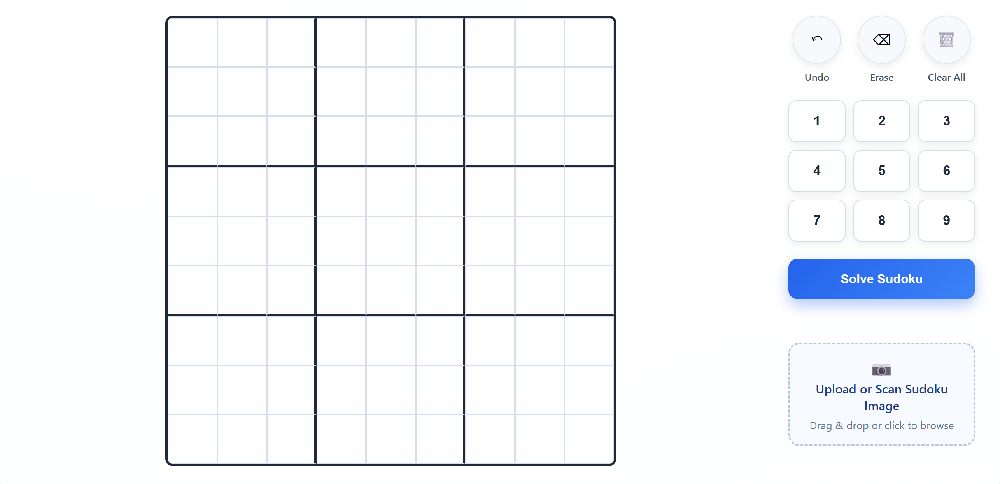

# 🧩 Sudoku Solver

A **C++ based Sudoku solver** that supports **manual grid input and image-based recognition** through a lightweight web interface.

The project combines **computer vision, machine learning inference, and a REST API backend** to solve Sudoku puzzles efficiently.

---

## ✨ Features

* 🧠 Solve Sudoku puzzles instantly
* ✏️ Manual Sudoku grid input from the browser
* 📷 Image upload and recognition pipeline
* 🔢 Digit recognition using **MNIST ONNX model**
* 🌐 Web-based interface for easy interaction
* ⚡ Fast backend solver implemented in **C++**

---

## 🖼 Demo



---

## 🏗 Architecture Overview

```
Frontend (HTML / CSS / JavaScript)
            │
            │  HTTP Requests (REST API)
            ▼
C++ HTTP Server (cpp-httplib)
            │
            │
      Sudoku Solver Logic
            │
            │
Computer Vision Pipeline
(OpenCV + ONNX DNN)
```

---

## 🛠 Technologies Used

### Backend

* **C++17**
* **CMake build system** (minimum 3.15)
* **Ninja build generator**
* **cpp-httplib** embedded HTTP server
* **REST-style HTTP API**

### Computer Vision & ML

* **OpenCV**

  * core
  * imgproc
  * imgcodecs
  * highgui
  * dnn
  * ml
* **ONNX model inference** using OpenCV DNN
* **MNIST digit recognition model (`mnist.onnx`)**

### Frontend

* **HTML5**
* **CSS3**
* **Vanilla JavaScript**

No frontend frameworks were used (no React / Vue / Angular).

### Browser APIs

* `fetch`
* `FormData`
* Drag & Drop API
* File input / camera capture

### Additional Libraries

* **Tesseract.js** (loaded via CDN)
* **JSON handling**
* **Multipart form-data handling**

### Platform Support

* Windows support using **Win32 API**

```
GetModuleFileNameA
```

Enabled under `_WIN32`.

---

## 🌐 REST API Endpoints

| Endpoint        | Method | Description                         |
| --------------- | ------ | ----------------------------------- |
| `/health`       | GET    | Check server status                 |
| `/solve-manual` | POST   | Solve Sudoku from manual grid input |
| `/solve-image`  | POST   | Solve Sudoku from uploaded image    |

---

## 📂 Project Structure

```
sudoku-solver
│
├── assets/
│   └── models/
│       ├── mnist.onnx
│       └── demo.png
│
├── include/        # Header files
│
├── src/            # C++ source files
│
├── index.html      # Web interface
├── simple-grid.html
├── style.css
├── script.js
│
├── CMakeLists.txt
└── README.md
```

---

## ⚙️ Build Instructions

### Requirements

* C++17 compatible compiler
* CMake ≥ 3.15
* Ninja
* OpenCV installed

### Build

```bash
mkdir build
cd build
cmake -G Ninja ..
ninja
```

Run the server:

```bash
./sudoku_server
```

---

## 🚀 Future Improvements

* Improve OCR accuracy
* GPU acceleration for inference
* Automatic Sudoku grid detection improvements
* Deploy online demo

---

## 👨‍💻 Author

**Rohan Rathod**

GitHub:
https://github.com/RohanRathodOnline

---

## 📄 License

This project is open-source and available under the MIT License.
